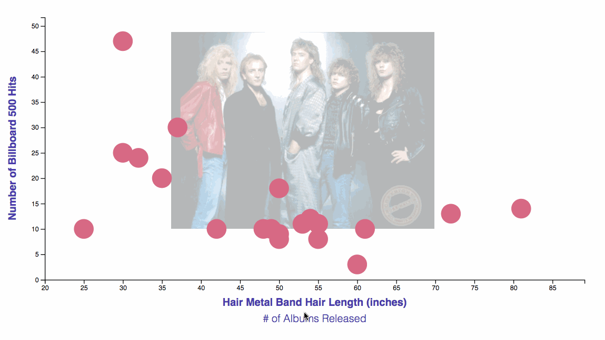
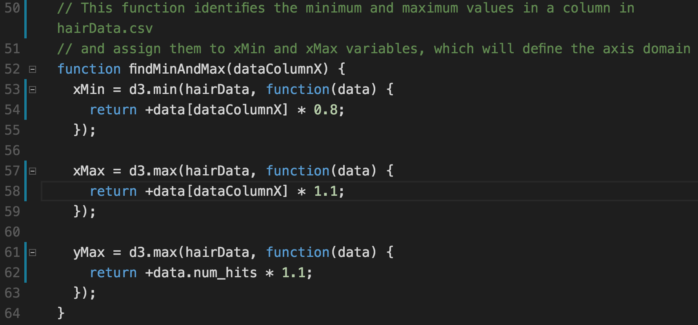
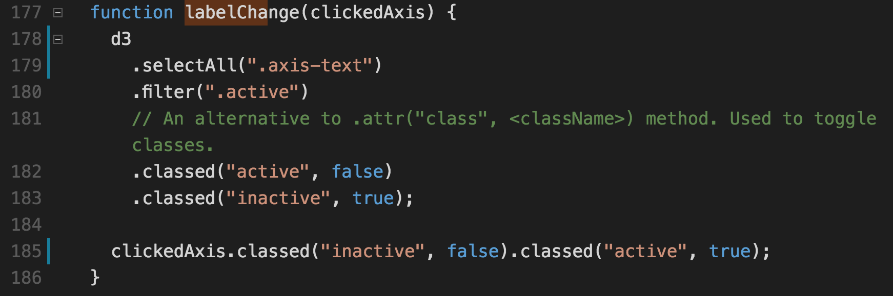
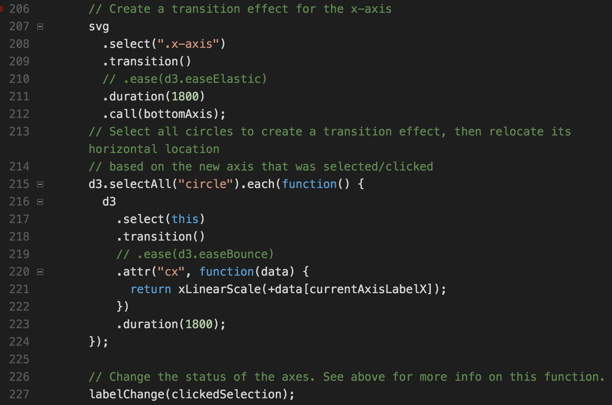

# Hair Metal Modularize

This activity will serve as a demonstration for how some of our D3 code can be split into reusable functions.

## Instructions

* Open the [Solved](Solved) folder with a server and study the completed chart. 

  

* Notice how we now have two x-axes that we can toggle to and from. 

* Open [hairData.csv](Solved/hairData.csv) notice that we now have an additional column of data: `num_albums`, which, of course, stands for the number of albums released by a band.

* The use of functions can help us overcome the challenge in this example, namely being able to toggle between two data columns (hair length and # of albums). In order for us to do that, there are several steps we take:

1. Upon clicking an axis label, we need to grab the name of the data column we wish to display. For example, when we click on `Hair Metal Band Hair Length (inches)`, we need to access the string "hair_length." This means that we need to store this information in the axis label somehow.

2. With the string "hair_length," we need a way to establish the minimum and maximum values of the `hair_length` data column. Likewise, when we click on `# of Albums Released`, we need to be able to access the min and max values of the `num_albums` column. 

3. With the min and max values of a data column, we can set the `domain` of the x-axis.

4. We also retrieve all the info in the pertinent data column with which we render the chart.

* Open the solved version of [app.js](Solved/app.js) to go over the following lines of code:

  

* We first note that in the previous ten or so lines, we have already defined the `range` of both x- and y-axes. We Have also declared undefined `xMin`, `xMax`, `yMin`, and `yMax` variables. We now turn our attention to the `findMinAndMax()` function.

* The purpose of this function is to determine the `domain` of x-axis. Point out that to find `yMin` and `yMax`, we search the `num_hits` column in the dataset. In other words, they are hard-coded. For `xMin` and `xMax`, however, a variable is fed into this function as the `dataColumnX` argument. 

* In the function call, we see the following code:

  ```js
  var currentAxisLabelX = "hair_length";
  findMinAndMax(currentAxisLabelX);
  ```

* The default label for the x-axis, then, is `"hair_length"` and we find the min and max values of the `hair_length` data column. However, we can later feed the argument `"num_albums"` to retrieve the min anx max values for that column.

* We will next go over a function that, upon clicking on an x-axis label, changes the CSS class of that axis, and the class of the other axis to inactive. This function highlights the active axis in bold, and the inactive one in a thinner font:

  

* Discuss the major features of this function:

  * It filters the currently active axis and assigns it `inactive` class name.

  * `classed()` is an alternative D3 method to `attr("classed", <class name>)`. It takes a class name and a true/false boolean as arguments, and is used to toggle classes of elements.

  * The function takes `clickedAxis` as its argument, and sets the class of the clicked axis to active.

* Finally, we will go over the big picture in the following (thankfully last!) block:

  

* Note the following:

  * In the first two lines, we determine whether the axis label that was clicked is inactive, and we grab its data attribute and assign it to the `clickedAxis` variable. In our example, it will be either `hair_length` or `num_albums`. 

  * If the axis is inactive, we call `findMinAndMax()` to find the min and max values of the pertinent data column, with which we set the axis's domain. 

  * We then select all circles currently on the page and change its x-coordinate with the scaled value of the data column: `xLinearScale(+data[currentAxisLabelX])`. 

  * We finally change the class of the clicked axis to `active`, and the other axis to `inactive`.  

* Try to address student questions, but you do not need to dwell on any particular point. Emphasize that understanding all of this will take some time and patience!
